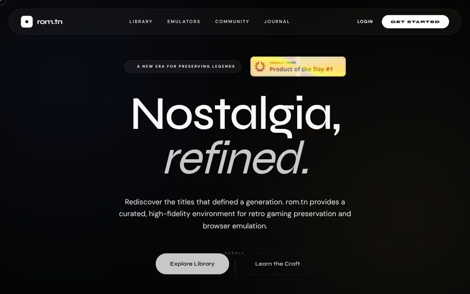

# roms.tn

## Overview
**roms.tn** is the ultimate destination for retro gaming enthusiasts. Our platform allows you to discover, explore, and play classic ROMs directly in your browser with high-fidelity rendering and accurate input support.

## Domain
Available at [roms.tn](https://roms.tn)

## Tech Stack
- [Next.js](https://nextjs.org)
- [Drizzle ORM](https://orm.drizzle.team)
- [Tailwind CSS](https://tailwindcss.com)
- [tRPC](https://trpc.io)
- [Bun](https://bun.sh)

## Learn More

To learn more about the [T3 Stack](https://create.t3.gg/), take a look at the following resources:

- [Documentation](https://create.t3.gg/)
- [Learn the T3 Stack](https://create.t3.gg/en/faq#what-learning-resources-are-currently-available) — Check out these awesome tutorials

You can check out the [create-t3-app GitHub repository](https://github.com/t3-oss/create-t3-app) — your feedback and contributions are welcome!

## How do I deploy this?

Follow our deployment guides for [Vercel](https://create.t3.gg/en/deployment/vercel), [Netlify](https://create.t3.gg/en/deployment/netlify) and [Docker](https://create.t3.gg/en/deployment/docker) for more information.
